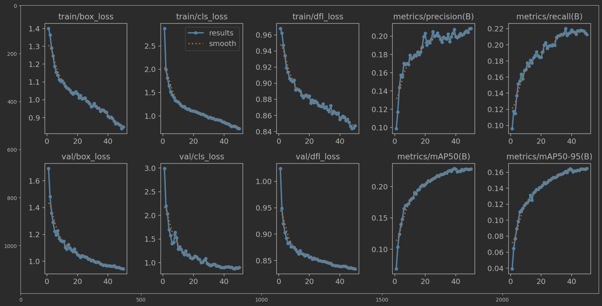
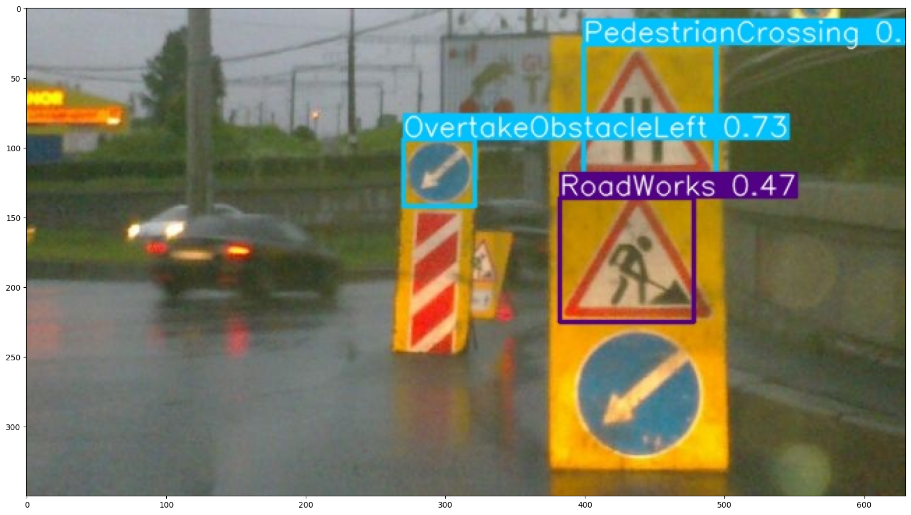

# Помощник для водителей

## Описание проекта

Целью данного проекта является обучение модели для детекции дорожных
знаков для определения ситуации на дороге и последующего информирования
водителя о потенциальной опасности.

## Сбор данных

Было принято решение взять уже размеченные данные с kaggle, 
[Russian traffic sign images dataset](https://www.kaggle.com/datasets/watchman/rtsd-dataset).
Особенность этих данных заключалась в том, что лэйблами были номера
дорожных знаков, а не их название. Например, у знака "Главная дорога"
был лейбл 2_1. Для решения этой проблемы был написан парсер сайта
дорожных знаков, который по номеру выдавал название на русском.
Далее с помощью языковой модели это название было переведено и сокращено.
Например, "Главная дорога" в MainRoad.

## Выбор модели и обучение

Для решения задачи была взята модель Yolov8. Для её обучения необходимо
было конвертировать данные из coco в yolo формат и далее запустить обучение.
Использовалась лишь часть данных, для этого выбиралось по 300 изображений
каждого класса, где возможно. Генерировался yaml файл и запускалось обучение.
## Результаты обучения: 

## Пример детекции

